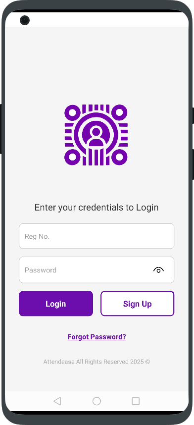
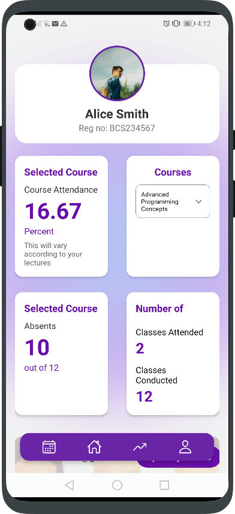
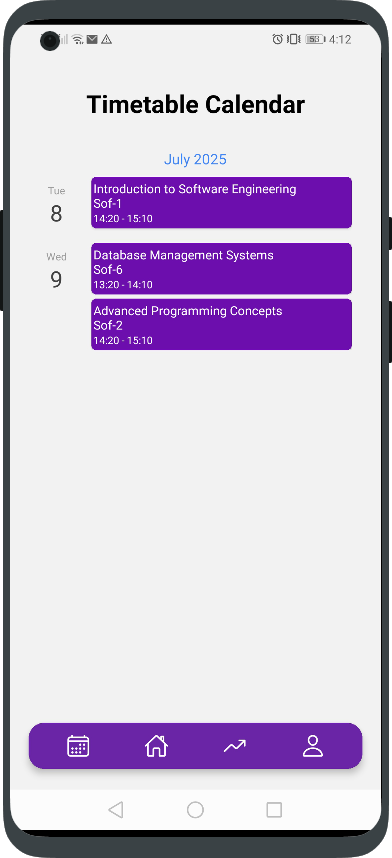

# AttendEase

**AttendEase** is a smart and secure attendance management system built to streamline classroom attendance in educational institutions using **QR codes**, **GPS radius validation**, and **OTP authentication**.

Designed for **university-level deployment**, the system ensures accurate, real-time, and contactless attendance, eliminating proxy marking and reducing administrative workload.

---

## 🚀 Features

- 📱 **Mobile-friendly UI** using React Native
- 📍 **GPS-based Radius Verification** for class location
- 🔐 **OTP Authentication** for added security
- 📸 **QR Code-based Attendance** for each course session
- 🧾 Real-time **attendance reporting and logs**
- 👩‍🏫 **Lecturer and Admin panel** for management and updates
- 🛡️ **Role-based Access Control** for Students, Lecturers, and Admin

---
## 🛠️ Tech Stack

| Layer         | Technology                         |
|---------------|---------------------------------   |
| Frontend      | React Native (App), ReactJs (web)  |
| Backend       | Node.js, Express.js                |
| Database      | MongoDB (MongoDB Compass)          |  
| Authentication| OTP (One-Time Password)            |
| Location      | Expo Location API                  |
| QR Codes      | `react-native-qrcode-svg`          |
| Testing       | Postman, Manual Functional Testing |

---

## 🧠 System Architecture

## 🔄 How It Works

1. **Lecturer** logs into the system and generates a **QR code** with GPS-locked coordinates.
2. **Student** scans the QR code from the projector screen using the mobile app.
3. Student enters the **OTP** generated by the system.
4. System validates:
   - Student identity
   - GPS location (within allowed radius)
   - OTP correctness
5. Upon validation, **attendance is marked** and saved to the database.
6. **Admin and faculty** can view logs and generate **attendance reports**.

---

## 🖼️ Screenshots

### 📱 Mobile App

  
  
  
  
  
  

---

### 💻 Web App ( Faculty Panel)

  

---
## 📥 Download & Access

- 📱 **Mobile App (APK):** [Download AttendEase v1.0.0](https://github.com/CodingBiyu/Attendease-fyp/releases)  
  _(Android app for students & faculty use)_

- 👨‍💼 **Admin Panel (Web):** [Admin Dashboard](https://admin-attendease.vercel.app/)  
  _(Manage faculty, courses, and view attendance reports)_

- 👩‍🏫 **Faculty Panel (Web):** [Faculty Dashboard](https://attendease-web.vercel.app/)  
  _(Generate QR codes, mark/toggle attendance, manage sessions)_

